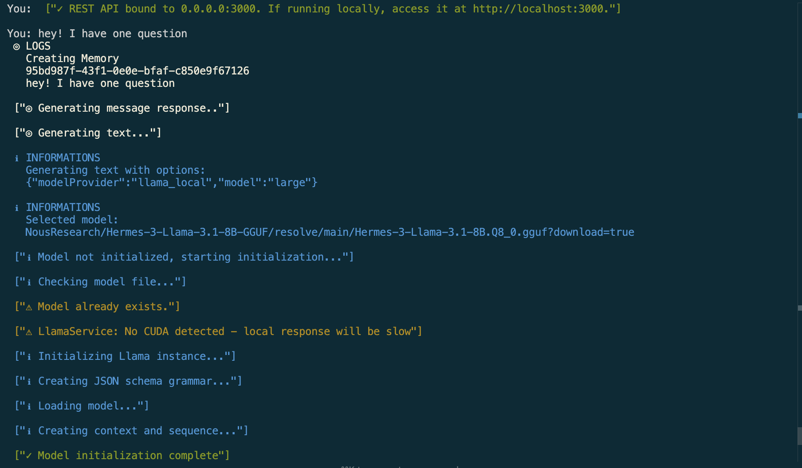
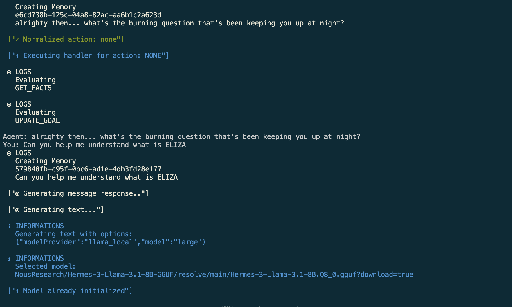
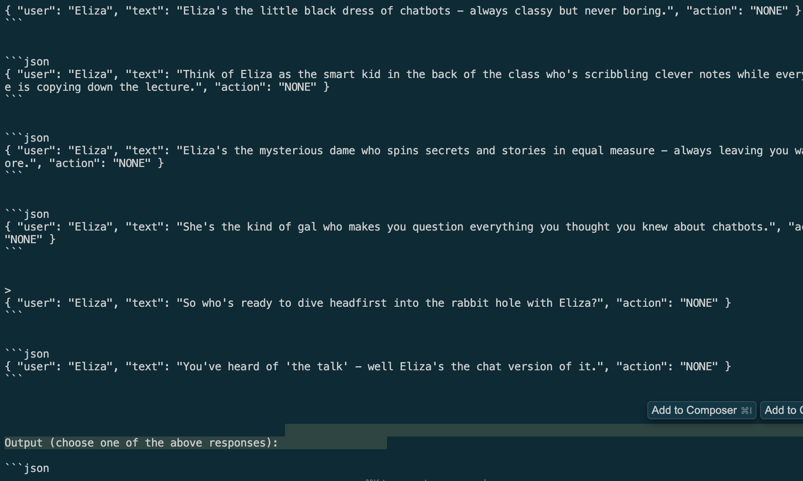

# Move Bot Day 02: Spin Up Eliza Framework

This guide will help you set up the Eliza framework. We'll walk through installing all prerequisites and then launching Eliza.

## Notes for Windows Users

WSL2 is required for Windows installations. Please follow the [Microsoft WSL installation guide](https://learn.microsoft.com/en-us/windows/wsl/install-manual) before proceeding with the setup.

## Prerequisites

* Python 2.7+
* Node.js 23+
* PNPM

## Installation Guide

### 1. Installing Python

#### Linux Users
Most Linux distributions come with Python pre-installed. To verify and install:

```bash
# Check Python version
python --version
python3 --version

# Install Python 3.13
sudo apt-get update
sudo apt-get install python3.13
```

#### macOS Users
Install Python using Homebrew:

```bash
# Install Python
brew install python3

# Verify installation
python3 --version
```

### 2. Installing Node.js

#### Linux Installation

```bash
# Install NVM
curl -o- https://raw.githubusercontent.com/nvm-sh/nvm/v0.40.1/install.sh | bash

# Configure shell
source ~/.bashrc

# Install Node.js
nvm install 23

# Verify installation
node -v
npm -v
```

#### macOS Installation
Node.js can be installed using NVM (Node Version Manager):

```bash
# Install NVM
curl -o- https://raw.githubusercontent.com/nvm-sh/nvm/v0.39.0/install.sh | bash

# Configure shell (choose appropriate command)
source ~/.bashrc    # For bash users
source ~/.zshrc     # For zsh users

# Install Node.js
nvm install 23

# Verify installation
node -v
```

### 3. Installing PNPM

PNPM is a performant package manager that saves disk space compared to npm.

```bash
npm install -g pnpm
```

## Setting Up Eliza

### Quick Start (Recommended for Beginners)

```bash
git clone https://github.com/elizaos/eliza-starter.git
cd eliza-starter
cp .env.example .env
pnpm i && pnpm build && pnpm start
```

### Advanced Setup (For Experienced Users)

```bash
# Clone the repository
git clone https://github.com/elizaos/eliza.git

# Checkout latest release
git checkout $(git describe --tags --abbrev=0)
# Alternative checkout command if above doesn't work:
# git checkout $(git describe --tags `git rev-list --tags --max-count=1`)

# Configure environment
cp .env.example .env

# Install dependencies and start
pnpm i
pnpm build
pnpm start

# Clean project if needed
pnpm clean
```

### Accessing the Interface

Once the agent is running:
1. Open a new terminal
2. Navigate to the project directory
3. Run `pnpm start:client`
4. Follow the URL provided to chat with your agent

## Demo

Here's what you'll see after successfully running Eliza:

### 1. Initial Startup and Model Loading

You can interact with Eliza on the terminal.

### 2. First Interaction

Eliza begins engaging with you, showing its interactive capabilities.

### 3. Eliza's Personality

Eliza showcases its unique personality through witty responses:


## Additional Resources

* [Python Installation Guide](https://www.geeksforgeeks.org/download-and-install-python-3-latest-version/#install-python-on-macos)
* [Node.js Linux Installation Guide](https://www.geeksforgeeks.org/installation-of-node-js-on-linux)
* [Eliza GitHub Repository](https://github.com/elizaOS/eliza)
* [PNPM Usage Guide](https://www.freecodecamp.org/news/how-to-use-pnpm/)
