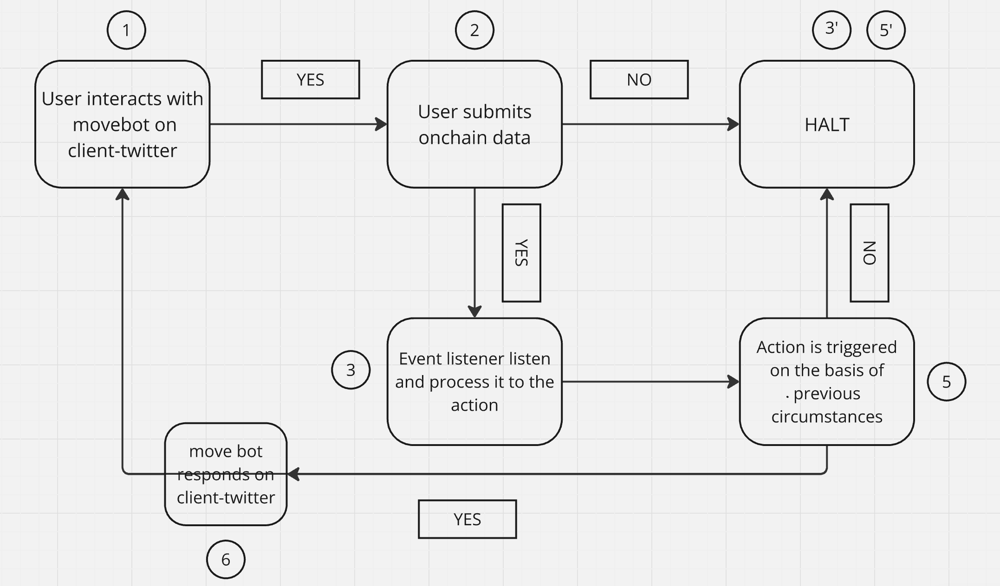

# Move Bot Day 07 - Deep Dive into Plugins

## Introduction
ElizaOS is a modular AI framework designed to create, deploy, and manage autonomous AI agents. The framework is built around the concepts of Agents, Providers, and Actions, each serving a specific role in augmenting agent capabilities. This document provides an in-depth exploration of these components and how they work together within the ElizaOS ecosystem.

## Table of Contents
1. Overview of Core Components  
2. Understanding Agents  
3. Understanding Providers  
   - Example: Time Context Provider  
4. Understanding Actions  
   - Example: Automated Twitter Reply Action  
5. Building a Plugin with ElizaOS  
   - Example: Blockchain-based Twitter Reply Listener  
6. General Examples  
7. Bringing it All Together  
8. Conclusion  

## Overview of Core Components
ElizaOS's architecture is centered around three primary components:

- **Agents**: Core entities that handle autonomous interactions, managing state, memory, and behavior across various platforms.
- **Providers**: Modules that inject dynamic context and real-time information into agent interactions, serving as bridges between the agent and external systems.
- **Actions**: Define the tasks and responses that agents can perform, allowing interaction with external systems and modification of agent behavior.

Each component enhances the agent’s ability to process data, make decisions, and execute tasks efficiently.

## Building a Plugin with ElizaOS
ElizaOS provides a flexible plugin system that enables developers to extend its capabilities. A plugin typically consists of a **Service** that listens for external triggers and an **Action** that defines how the agent responds. Below, we demonstrate how to build a blockchain-integrated Twitter reply listener using ElizaOS.

### Example: Blockchain-based Twitter Reply Listener
This example showcases how an ElizaOS agent can monitor blockchain events and automatically respond to tweets based on specific triggers.



#### 1. Blockchain Event Listener Service
This service continuously monitors blockchain events and triggers an action when relevant data is detected.

```typescript
import { IAgentRuntime, Service, ServiceType, elizaLogger } from "@elizaos/core";
import { fetchBlocksWithEvents, BlockFetcherConfig, TweetReplyEvent } from './block-fetcher';

let lastProcessedHeight = 7620233; // Starting block height
const POLLING_INTERVAL = 5000; // 5 seconds

export const tweetReplyListener: Service = {
    serviceType: ServiceType.BROWSER,
    initialize: async (runtime: IAgentRuntime) => {
        while (true) {
            try {
                const events = await fetchBlocksWithEvents(lastProcessedHeight);
                for (const event of events) {
                    if (event.status === "PENDING") {
                        await runtime.processActions(event, [event]);
                    }
                }
                lastProcessedHeight += 100;
                await new Promise(resolve => setTimeout(resolve, POLLING_INTERVAL));
            } catch (error) {
                elizaLogger.error('Error in event polling loop:', { error: error.message });
            }
        }
    }
};
```

#### 2. Action for Replying to Tweets
Once the event listener detects a new blockchain event, it triggers this action to reply to a tweet automatically.

```typescript
import { Action, IAgentRuntime, Memory, elizaLogger } from "@elizaos/core";
import { Scraper } from "agent-twitter-client";

export const replyAction: Action = {
    name: "TWEET_REPLY",
    handler: async (runtime: IAgentRuntime, message: Memory) => {
        try {
            const { tweet_link, user } = message.content;
            const scraper = new Scraper();
            await scraper.login(runtime.getSetting("TWITTER_USERNAME"), runtime.getSetting("TWITTER_PASSWORD"));
            await scraper.sendTweet(`Thanks @${user} for your request!`, tweet_link);
            return true;
        } catch (error) {
            elizaLogger.error("Error in reply action:", error);
            return false;
        }
    }
};
```

For a deeper understanding, consult the **[documentation](https://elizaos.github.io/eliza/docs/intro/)**.

## Conclusion
In a fully integrated ElizaOS agent, these components interact as follows:

1. **The Agent** manages autonomous interactions and maintains state and memory.
2. **Providers** supply dynamic contextual information to the agent, enriching interactions with real-time data.
3. **Actions** define the tasks and responses that the agent performs based on provided inputs.
4. **Plugins** extend the agent's functionality, allowing it to interact with new systems such as blockchains and social media platforms.

With these building blocks, you can create highly interactive AI agents that automate workflows efficiently.

