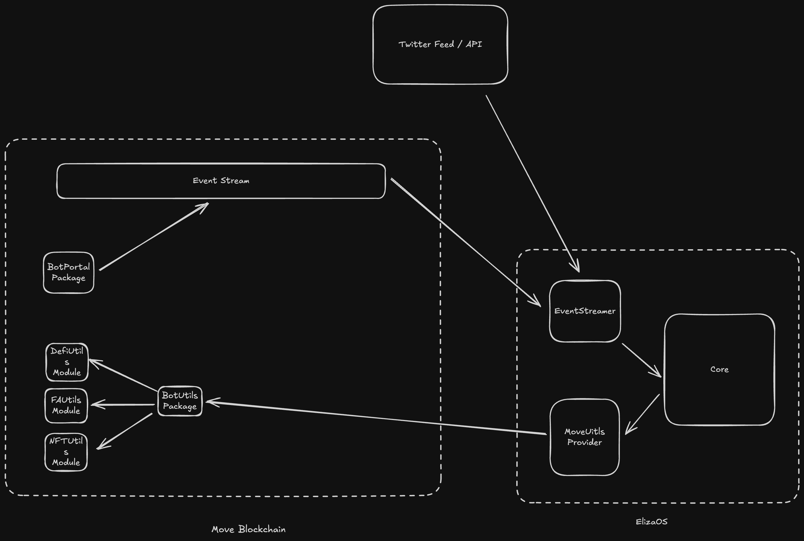

# 🤖 Move Bot Day 05: Background and Architecture

Till now, talked about basics behind Eliza and how to set it up. Today, we will be giving a brief high level overview about our Move Bot and what it will be trying to achieve.

**MoveBot v0.1**

So what is MoveBot? MoveBot is an AI agent powered by Eliza with the aim to provide simplified interface for all things Movement.

Need to transfer some Move tokens to another account? Write a tweet to MoveBot.

Need to mint a NFT? Ping Movebot with the details.

With the growing use and ease of AI agents and with Crypto reaching even higher scale, reducing friction and simplifying onboarding of user's is the next big step. With MoveBot, we try to solve this problem helping user's to be onboarded over Movement without any blockchain experience.

## Architecture

The MoveBot contains of three major stack-

- **ElizaOS** - It contains all the core logic and AI integrations. By building custom providers we can connect ElizaOS AI capabilities to Movement Blockchain.
  - **EventStreamer** - This is inbound streamer which interacts with Movement blockchain to listen for all the user queries.
  - **MoveUtils Provider** - This providers contains all the connections to essential Movement functions which can be called to perform all the operations on the blockchain.
- **Movement Blockchain** - This is our primary blockchain where user's want to interact with in the end.
  - **BotUtils Package** - This package contains all the neccessary integrations with Movement Token, Digital and Fungible Assets and various DeFi protocols.
  - **BotPortal Package** - This package acts as an entry point for users to interact with the MoveBot.
- **Twitter API** - All the details present in the twitter feed will be fetched using the API. The user's tweet will act as a context for ElizaOS to perform any future tasks.

The bot is not limited to only performing Movement related tasks, it can also give generic replies to the user's tweet depending on the decision made.

## Background

In order to better understand architecture of ElizaOS it's important to understand all the core concepts.

### Character Files

Character files are JSON-formatted configurations that define an AI character's personality, knowledge, and behavior patterns.

### Agents

Agents are the core components of the Eliza framework that handle autonomous interactions. Each agent runs in a runtime environment and can interact through various clients (Discord, Telegram, etc.) while maintaining consistent behavior and memory.

### Providers

Providers are core modules that inject dynamic context and real-time information into agent interactions. They serve as a bridge between the agent and various external systems, enabling access to market data, wallet information, sentiment analysis, and temporal context.

### Actions

Actions are core building blocks in Eliza that define how agents respond to and interact with messages. They allow agents to interact with external systems, modify their behavior, and perform tasks beyond simple message responses.

### Evaluators

Evaluators are core components that assess and extract information from conversations. They integrate with the AgentRuntime's evaluation system.

## Resources

- [ElizaOS - Character](https://elizaos.github.io/eliza/docs/core/characterfile/?utm_source=chatgpt.com)
- [ElizaOS - Agents](https://elizaos.github.io/eliza/docs/core/agents/?utm_source=chatgpt.com)
- [ElizaOS - Providers](https://elizaos.github.io/eliza/docs/core/providers/?utm_source=chatgpt.com)
- [ElizaOS - Actions](https://elizaos.github.io/eliza/docs/core/actions/?utm_source=chatgpt.com)
- [ElizaOS - Evaluators](https://elizaos.github.io/eliza/docs/core/evaluators/?utm_source=chatgpt.com)
- [Move Book](https://aptos.dev/en/build/smart-contracts/book/SUMMARY)
